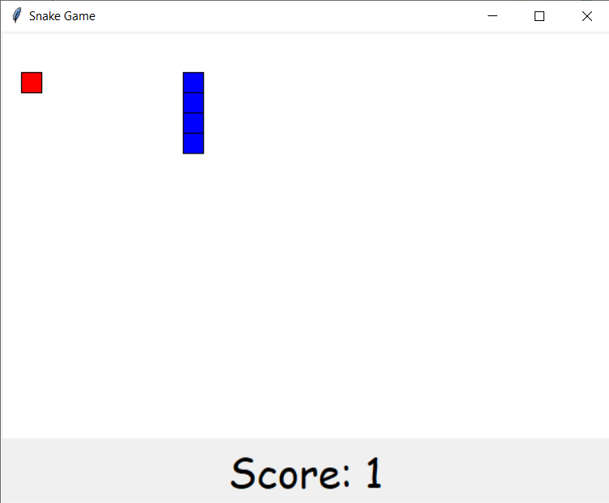
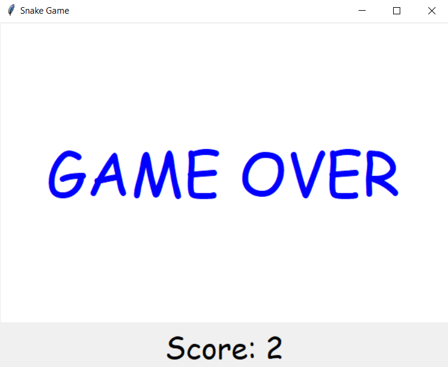

# Baby Snake Game
This is my final project for Stanford University's online course Code in Place 2024.  
This python program is a simple version of the famous snake game.  
The program includes most of Code in Place's course lectures such as lists, loops, random library and graphics.

## Instructions
The game starts with the snake moving downwards continuosly. Player should control the snake with the  arrow keys.    
Eating Food:  
Food appears randomly on the game board. Player should guide the snake to the food to eat it. 
Each time the snake eats the food, it grows longer and a new food appears randomly on another position of the game board.   
Avoiding Collisions:  
Player should not let the snake run into the wall of the game area and to not collide with itself.  
Scoring:  
Score increases with each piece of food the snake eats. The score is usually displayed on the screen.   
Game Over:  
The game ends if the snake runs into the walls or its own body.

## Other Information
I am deeply thankful for the amazing learning experience during Code in Place 2024. 
Since I am new at Python and programming, my project is relatively straightforward and simple.  
I eagerly anticipate the opportunities to grow and evolve.  
Here are some images from the game    

